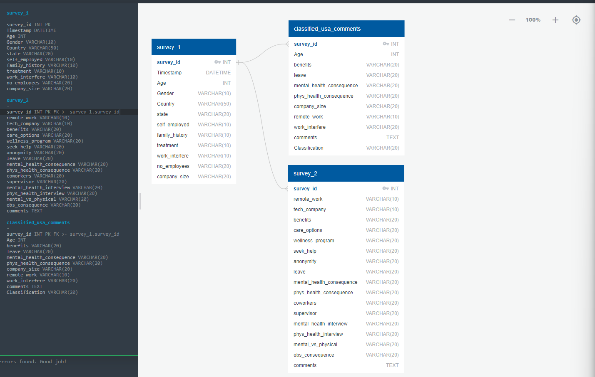

# Proj3-grp4-Mentalhealth_Tech

# <u>The Invisible Struggle: Mental Health in the Tech Industry</u>

# SQLite Database Creation and Table Combination

This project outlines the steps to create and manipulate an SQLite database using survey data and visualize the data structure through an Entity-Relationship Diagram (ERD).

## Entity-Relationship Diagram (ERD)

The ERD below represents the structure and relationships between the survey tables used in this project:



- **survey_1**: Contains basic demographic and personal information of respondents.
- **survey_2**: Contains additional survey responses related to workplace and mental health.
- **classified_usa_comments**: Contains classified comments and additional data linked to respondents.
-  **Primary key is `survey_id` to join across all tables

## Steps:

1. **Create SQLite Connection:**
   - Establish a connection to the SQLite database named `survey_database.db`.
   - SQLite is often preferred for smaller projects or applications where simplicity and minimal setup are key, as it is a lightweight, serverless database that stores data in a single file and requires no configuration. In contrast, PostgreSQL is a more powerful, full-featured database that is better suited for complex, multi-user applications but requires more setup and maintenance. SQLite is easier to use for quick development and testing, while PostgreSQL offers greater scalability and advanced features for larger-scale deployments.

2. **Create Tables:**
   - Convert and load three DataFrames (`survey_1_df`, `survey_2_df`, `survey_3_df`) into three separate SQLite tables named `survey_1`, `survey_2`, and `classified_usa_comments`.

3. **Drop Existing Combined Table:**
   - Remove the existing `survey_data_combined` table if it exists to avoid conflicts.

4. **Create Combined Table:**
   - Merge data from the three tables into a new table called `survey_data_combined` using SQL `JOIN` operations:
     - Perform an inner join between `survey_1` and `survey_2` on `survey_id`.
     - Perform a left join with `classified_usa_comments` on `survey_id` to include the `classification` data.

5. **Commit Changes and Close Connection:**
   - Save the changes and close the database connection.

6. **Verify Data:**
   - Query and display the combined data from `survey_data_combined` to ensure the merge was successful.

7. **Output:**
   - The combined data is displayed in a tabular format for review.


## FLASK Server
server/mental_health_app.py
This flask app exposes the JSON API.
Each API function returns relevant data that the client can use for plotting etc.

Each API function handles one query e.g.:
1. /mental-vs-physical
2. //mental-health-comments

## Client
client/mental_health_dashboard.html
Menu on the left invokes javascript functions for each menu item.
the function handleMenuClick gets the name of the menu item as variable 'section'.
This 'section' is used to query the JSON API.
The received JSON is then used to plot graphs using plotly


## HOW TO RUN
### Start Server
#### Install flask
pip install flask
pip install flask_cors

#### Run server
python server/mental_health_app.py
This will show the address. Copy and paste in browser.
e.g.
```
python server/mental_health_app.py
 * Serving Flask app 'mental_health_app'
 * Debug mode: on
WARNING: This is a development server. Do not use it in a production deployment. Use a production WSGI server instead.
 * Running on http://127.0.0.1:5000
Press CTRL+C to quit
 * Restarting with stat
 * Debugger is active!
 * Debugger PIN: 131-636-924
 ```

#### Make sure you see something like this
Running on http://127.0.0.1:5000
This address is important and is used in the client when making API requests
e.g. const apiUrl = 'http://127.0.0.1:5000/' + section;